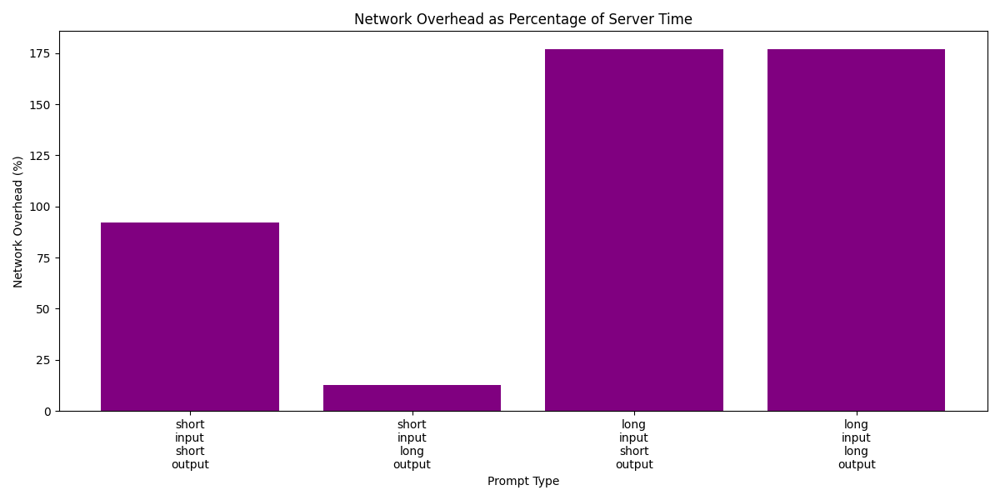

# Cerebras Inference Performance Evaluation

This repository contains code and results from benchmarking the Cerebras Inference Cloud using the Llama 3.3 70B model.

## Usage Instructions

### Setup

This project uses `uv` for Python package management.

```bash
# Install dependencies
uv pip install -e .

# Set up API key
export CEREBRAS_API_KEY=your_api_key_here
# or create a .env file with CEREBRAS_API_KEY=your_api_key_here
```

### Running Benchmarks

Run the benchmarking script with default parameters:

```bash
python main.py
```

Or customize the parameters:

```bash
python main.py --concurrency=1 --model=llama-3.3-70b --num_iterations=10 --output_dir=results
```

### Generating Plots

After running the benchmarks, generate visualization plots:

```bash
python plots.py
```

To specify a particular results file:

```bash
python plots.py --json_path=results/benchmark_results_llama-3.3-70b_concurrency_1_iterations_10_20250301_164629.json
```

### Extending for Higher Concurrency

The code supports higher concurrency levels, though the free tier of Cerebras API has rate limits:

```bash
# For batch size 100 (only on paid tier)
python main.py --concurrency=100
```

## Approach

The benchmarking approach focused on measuring both server-side and client-side metrics to provide a comprehensive understanding of Llama 3.3 70B performance on the Cerebras Inference Cloud. The evaluation was conducted with four different prompt types to test various input/output scenarios:

1. **Short input, short output**: Simple question/answer scenarios
2. **Short input, long output**: Creative generation from brief prompts
3. **Long input, short output**: Summarization of lengthy texts
4. **Long input, long output**: Detailed analysis of extensive documents

Each test was run multiple times (3-20 iterations) to calculate averages and standard deviations, ensuring statistical reliability. The implementation used the Cerebras Python SDK to collect metrics while carefully timing the client-side request lifecycle.

Key metrics measured included:
- Server-side latency components:
  - Total server processing time
  - Prompt processing time (time to process input)
  - Completion time (time to generate output)
  - Queue time (waiting time before processing)
- Server-side throughput (completion tokens generated per second)
- Client-side metrics:
  - Total request time (end-to-end latency including network overhead)
  - Time to first token
  - Output speed (tokens received per second at the client)
- Token usage statistics:
  - Prompt tokens consumed
  - Completion tokens generated
  - Total tokens processed
- Statistical reliability measures:
  - Standard deviations for all timing metrics
  - Averages across multiple iterations
- Network overhead analysis:
  - Absolute time difference between server and client measurements
  - Percentage overhead relative to server processing time

## Challenges Encountered

### API Rate Limits

During the benchmark implementation, two types of rate limit errors were encountered:

1. **Requests Per Minute Limit**: Initially observed with many iterations per test:
   ```
   cerebras.cloud.sdk.RateLimitError: Error code: 429 - {'message': 'Requests per minute limit exceeded - too many requests sent.', 'type': 'too_many_requests_error', 'param': 'quota', 'code': 'request_quota_exceeded'}
   ```

Addressed by implementing rate limiting via retry logic with exponential backoff.

2. **Daily Token Quota Limit**: After rate limiting for requests was implemented:
   ```
   cerebras.cloud.sdk.RateLimitError: Error code: 429 - {'message': 'Tokens per day limit exceeded - too many tokens processed.', 'type': 'too_many_requests_error', 'param': 'quota', 'code': 'token_quota_exceeded'}
   ```

Addressed by reducing test iterations and optimizing token usage.

## Measurements and Analysis

### Server vs. Client Latency


The relationship between server-side and client-side latency varies significantly across prompt types and test runs:

| Prompt Type | Server Latency Range (s) | Client Latency Range (s) | Network Overhead Range (%) |
|-------------|-------------------------|-------------------------|--------------------------|
| Short Input, Short Output | 0.17-0.24 | 0.31-0.38 | 60-105% |
| Short Input, Long Output | 0.80-0.95 | 0.93-1.07 | 12-19% (213% in outlier run) |
| Long Input, Short Output | 0.10-0.17 | 0.27-0.53 | 139-349% (up to 1773% in outlier runs) |
| Long Input, Long Output | 0.66-0.90 | 0.78-5.29 | 18-551% |

**Key Insight**: Short input, long output scenarios consistently show the most predictable network overhead, typically around 12-19%. Long input scenarios exhibit much higher variability, with some tests showing extreme network overhead percentages.

### Time to First Token


Time to first token (TTFT) measurements revealed distinct patterns across prompt types:

| Prompt Type | TTFT Range (s) | TTFT Variability |
|-------------|---------------|-----------------|
| Short Input, Short Output | 0.13-0.15 | Low (σ ≈ 0.03-0.06s) |
| Short Input, Long Output | 0.12-0.19 | Low-Moderate (σ ≈ 0.02-0.12s) |
| Long Input, Short Output | 0.14-2.45 | High (σ ≈ 0.03-9.67s) |
| Long Input, Long Output | 0.12-4.48 | Extremely High (σ ≈ 0.01-13.70s) |

**Key Insight**: TTFT for short inputs is consistently fast and predictable. For long inputs, TTFT is highly variable and can sometimes be unexpectedly high, suggesting that applications handling large contexts need robust timeout handling and user feedback mechanisms.

### Server vs. Client Throughput


Throughput comparison between server and client showed more consistency than latency metrics:

| Prompt Type | Server Throughput Range (tokens/s) | Client Throughput Range (tokens/s) | Difference Range (%) |
|-------------|----------------------------------|----------------------------------|---------------------|
| Short Input, Short Output | 2185-2535 | 2222-3106 | -31 to +10% |
| Short Input, Long Output | 1723-1776 | 1691-1786 | -3.5 to +2.1% |
| Long Input, Short Output | 935-1388 | 814-2630 | -145 to +100% |
| Long Input, Long Output | 2097-2297 | 2097-2310 | -4.4 to +3.5% |

**Key Insight**: Throughput is most consistent for generation-intensive workloads (short input, long output and long input, long output). The extreme variability in long input, short output scenarios is likely due to the small number of output tokens making throughput measurements less reliable.

### Server Component Times


Breaking down server-side processing reveals consistent patterns:

1. **Queue times** were generally negligible (<10ms) with occasional spikes up to 20ms
2. **Prompt processing time** scaled with input length:
   - Short inputs: ~0.002-0.004s
   - Long inputs: ~0.07-0.12s
3. **Completion time** dominated total server time for generation-heavy tasks:
   - Short outputs: ~0.03-0.19s
   - Long outputs: ~0.69-0.95s

**Key Insight**: Prompt processing is highly efficient even for large context windows. The bulk of processing time is spent on token generation, which is fairly consistent across test runs given the same output length.

### Network Overhead



The network overhead analysis confirmed significant variability in how network transmission affects total latency:

- **Short input, long output**: Most consistently efficient with typically 12-19% overhead
- **Long input scenarios**: Highly variable overhead, ranging from ~18% to over 1700% in extreme cases
- **Short input, short output**: Moderate but consistent overhead around 60-105%

### Token Usage


Token usage analysis showed:

1. Short input prompts used ~39-66 tokens
2. Long input prompts used ~1700-3100 tokens
3. Short outputs generated ~35-453 tokens
4. Long outputs generated ~1225-1780 tokens

This distribution provided a good sampling of the model's operational range within the context window.

### Variability Analysis


The variability heatmap reveals which metrics showed the most inconsistency:

1. **Queue time** showed high relative standard deviation across all prompt types
2. **Time to first token** had extreme variability in long input scenarios
3. **Client-side metrics** generally showed more variability than server-side metrics
4. **Short input, long output** scenarios consistently showed the lowest variability

### Statistical Distribution


The box and whisker plots demonstrate the statistical distribution of key metrics, highlighting:

1. The tight clustering of server latency measurements
2. The wider spread of client-side metrics
3. The presence of outliers, particularly in long input scenarios
4. The consistent throughput for generation-heavy workloads despite latency variability

## Additional Visualization Resources

The plots above represent one benchmark run. For transparency and completeness, the [raw data](results/) and [visualizations](plots/) from all benchmark runs are available.

## Challenges and Key Insights

### Challenges

1. **Measurement Variability**: Significant variability was observed across test runs, particularly for long input scenarios and client-side metrics.

2. **Rate Limit Management**: Working within the constraints of the free tier required implementing robust retry mechanisms and carefully managing token usage.

3. **Network Impact Analysis**: Network overhead varied substantially across tests, making it difficult to establish consistent expectations for real-world performance.

4. **Outlier Handling**: Some tests showed extreme values for metrics like time to first token and network overhead.

### Key Insights

1. **Input Length Impact**: Large input prompts generally created higher and more variable network overhead, affecting real-world performance beyond what server metrics indicated.

2. **Predictable Generation Performance**: Despite variability in other metrics, token generation throughput remained relatively consistent for a given prompt type, especially for scenarios with longer outputs.

3. **Short Input, Long Output Efficiency**: This scenario consistently showed the most predictable and efficient performance, with low network overhead and stable throughput.

4. **Time to First Token Challenges**: TTFT for long inputs showed high unpredictability, with some tests showing acceptable values (~0.15s) and others showing potentially problematic delays (2-4s).

## Conclusion

The Cerebras Inference Cloud with Llama 3.3 70B showed impressive performance characteristics, particularly in throughput consistency for generation-intensive workloads. However, applications should account for:

1. The variable impact of network overhead, especially for large input contexts
2. Unpredictable time to first token for long inputs
3. Occasional queue time spikes
4. API rate limits that require thoughtful implementation of retry logic

For optimal user experience, applications should implement:
- Progress indicators for long input processing
- Streaming UI for long outputs to maintain perceived responsiveness
- Reasonable timeouts based on input size expectations
- Client-side heuristics that adapt to the performance patterns observed in this analysis
- Robust error handling for rate limits with appropriate backoff strategies

The most reliable performance was consistently observed with short input, long output scenarios, suggesting this is an ideal usage pattern when possible.
